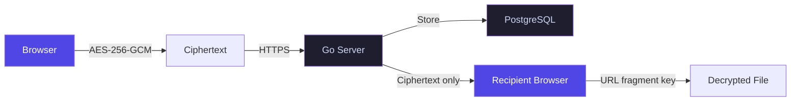

# Step 12 — README: The Repository's Landing Page

**Parent:** [Hackathon Index](./2026-05-22-hackathon-index.md)  
**Priority:** 🟡 High  
**Effort:** S (half day)  
**Status:** 🔲 TODO

---

## Why This Is New (Not in v1)

The v1 plan treated the README as a footnote. But for a hackathon judge reviewing the repository, the README **is** the landing page. A great README does three things:

1. **Hooks** — In 5 seconds, the judge knows what this is and why it matters.
2. **Proves** — Screenshots, architecture diagram, test results, live URL.
3. **Enables** — `git clone && make dev` and the thing runs.

If the README makes a judge star the repo before they clone it, you've won something bigger than a hackathon.

---

## Current State (Summary)

The current `README.md` is functional — it has build instructions, license info, and a brief description. But it reads like a default template. It doesn't convey the product's soul.

---

## Implementation Plan

### 12.1 — Hero Section

```markdown
# QuantiX Drive 🔐

**Zero-knowledge encrypted vault. Your files, your keys, your rules.**

The server can't read your data. Not because we promise — because the architecture makes it impossible.

[](link) [](link) [](link)


```

The hero must:
- State the value proposition in one line
- Include status badges (E2E, unit tests, live demo)
- Show a screenshot of the most visually impressive view (Cyberpunk dashboard)

### 12.2 — "How It Works" Architecture Diagram

Use a mermaid diagram embedded in the README:



Label: *"The server stores ciphertext. Decryption keys live in the URL fragment — they never leave the browser."*

### 12.3 — Features Section (Concise)

```markdown
## Features

| Feature | What it does |
|---------|-------------|
| 🔐 Zero-Knowledge Encryption | AES-256-GCM in your browser. Server stores ciphertext only. |
| 🔗 Secure Sharing | Share links with fragment keys. Server never sees the key. |
| 🤖 Agent API Keys | Scoped, revocable keys for CI/CD and LLM integrations. |
| 📁 Encrypted Drop Portals | Anonymous file collection with client-side encryption. |
| 🌍 Multilingual | English + Spanish (MX). Deep-merge downstream overlays. |
| 🎨 6 Premium Themes | CSS-variable driven. FOUC-free. Dark + light. |
| 📱 PWA Ready | Installable. Works offline for cached content. |
```

### 12.4 — Quick Start Section

```markdown
## Quick Start

### Prerequisites
- Go 1.25+
- Node.js 20+
- PostgreSQL 15+

### Run Locally
```bash
# Backend
cp .env.example .env  # configure DB_URL, JWT_SECRET
go run github.com/pressly/goose/v3/cmd/goose@latest -dir sql/schema postgres "$DB_URL" up
go run .

# Frontend
cd vaultdrive_client
npm install
npm run dev
```

### Run Tests
```bash
# Unit tests (116/116)
cd vaultdrive_client && npm run test

# E2E tests (41/41)
cd vaultdrive_client && npm run build -- --mode test
npx playwright test

# Backend tests
go test ./...
```
```

### 12.5 — Test Results & Live URL

```markdown
## Status

| Suite | Result | Coverage |
|-------|--------|----------|
| Vitest (frontend) | 116/116 ✅ | Components, crypto, i18n |
| Playwright (E2E) | 41/41 ✅ | Full lifecycle flows |
| Go tests | All passing ✅ | API handlers, auth, crypto |

**Live Production:** [quantixdrive.filemonprime.net/quantix/](https://quantixdrive.filemonprime.net/quantix/)
```

### 12.6 — Tech Stack Section

```markdown
## Tech Stack

| Layer | Technology |
|-------|-----------|
| Backend | Go 1.25, net/http, PostgreSQL, goose migrations |
| Frontend | React 18, Vite 6, TypeScript, React Router 7 |
| Crypto | WebCrypto API (AES-256-GCM, RSA-2048) |
| Testing | Vitest, Playwright, Go testing |
| Deployment | systemd, Apache reverse proxy, Let's Encrypt |
| i18n | i18next, react-i18next, browser-language-detector |
```

### 12.7 — Downstream Overlay Note

```markdown
## Downstream Deployments

QuantiX Drive supports downstream brand overlays via environment variables and i18n overrides.
The ABRN-Drive deployment shares this codebase with distinct branding, colors, and terminology.

See [branding.ts](vaultdrive_client/src/config/branding.ts) for the configuration surface.
```

### 12.8 — Screenshots

Capture 4 screenshots for the README:
1. Landing page (Elegant theme) — the hero with animated gradient
2. Dashboard (Cyberpunk theme) — stat cards with neon glow
3. Share modal (QuantiX dark theme) — the copy-link flow
4. Mobile view (375px, Elegant) — proving responsive works

Save to `docs/screenshots/` and reference from the README.

---

## Verification

| Check | Expected | How to verify |
|-------|----------|---------------|
| Hero hooks in 5 seconds | Clear value prop + screenshot | Read first 10 lines |
| Architecture diagram | Mermaid renders on GitHub | Push to GitHub, check |
| Quick start works | Clone → run in <5 minutes | Follow the instructions fresh |
| Status badges accurate | Match actual test counts | Run tests, compare |
| Screenshots present | 4 images, all loading | Check GitHub rendering |
| Downstream note | Explains ABRN relationship | Read the section |
| No broken links | All relative paths resolve | Click each link on GitHub |

---

## Risk

**None.** Pure documentation. Reversible. No code changes. No test risk.

The only risk is screenshots becoming stale if the UI changes — mitigate by regenerating screenshots as the last step of any UI change.

---

## Evidence Log

| Date | What was done | Verified? | Commit |
|------|--------------|-----------|--------|
| | | | |
