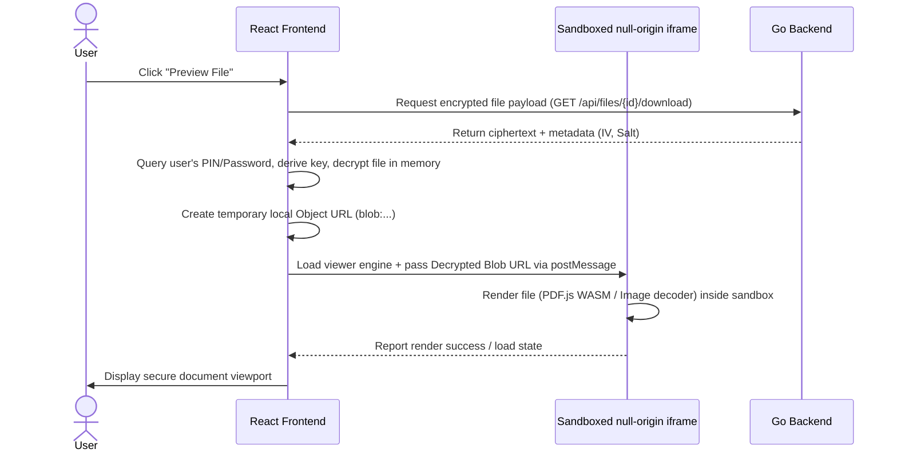

# Step 1: Sandboxed WASM In-Browser Zero-Knowledge Document & Media Viewer

This step introduces a secure, in-browser document preview system. Since all files in QuantiX/ABRN Drive are encrypted browser-side, viewing them usually requires downloading the file to local storage. This plan implements local memory decryption coupled with sandboxed WebAssembly rendering.

---

## 🎯 Goal
Allow users to inspect PDFs, text files, images, and audio/video directly in the browser. Decryption must occur completely in the browser's memory, and the rendering context must be isolated from the main application's credentials (localStorage, cookies, session keys) to prevent malicious files from exploiting the browser.

---

## 🏗️ Architecture & Cryptographic Flow



### 1. The Sandbox Isolation Layer
To prevent decrypted files (like malicious PDFs with embedded javascript or HTML files masquerading as docs) from executing scripts in the context of the main app, rendering must happen in a null-origin environment:
- An `<iframe>` element is mounted with the following attributes:
  ```html
  <iframe
    sandbox="allow-scripts"
    srcdoc="...document viewer engine code..."
    class="w-full h-full border-0"
  />
  ```
- By omitting `allow-same-origin`, the iframe is forced into a unique null origin. It cannot read `localStorage`, access cookies, or access `window.parent` properties.

### 2. WASM Rendering Engines
- **PDFs**: A lightweight WebAssembly-based PDF.js build is loaded directly inside the sandboxed iframe.
- **Images/Text**: Native browser decoders render images and text in-sandbox.

---

## 💻 Proposed Changes

### 1. Frontend Components

#### [NEW] [DocumentViewerModal.tsx](file:///lamp/www/QuantiX-Drive/vaultdrive_client/src/components/viewer/DocumentViewerModal.tsx)
- Reusable React modal component using the core theme-adaptive dialog shell.
- Derives the decryption key using `useSessionVault()`.
- Fetches the ciphertext and decrypts it into a memory `Uint8Array`.
- Converts the array to a `Blob` and creates a local object URL: `URL.createObjectURL(blob)`.
- Mounts the sandboxed `<iframe>` and transfers the blob URL safely via `postMessage`.

#### [NEW] [viewer-sandbox.html](file:///lamp/www/QuantiX-Drive/vaultdrive_client/public/viewer-sandbox.html)
- Isolated HTML template placed in the public folder to serve as the iframe target.
- Contains the static viewer layout and registers an event listener for `postMessage` data:
  ```javascript
  window.addEventListener('message', (event) => {
    // Only accept messages containing blob URLs or file data
    const { blobUrl, mimeType } = event.data;
    // Render logic based on mimeType
  });
  ```

---

## 🎨 Brand Customization

### QuantiX Neon
- Cyberpunk dark viewer HUD overlay.
- Flashing "DECRYPTING LOCAL MEMORY..." neon cyan scanner bar during loading.
- Glowing border styling (`shadow-[0_0_15px_rgba(1,255,247,0.35)]`) and HUD controls (zoom, download, rotate).

### ABRN Burgundy
- Clean, slide-out right drawer overlay.
- Minimalist burgundy loading indicator.
- Classical layout with elegant top control bar using standard corporate buttons.

---

## 🧪 Verification Plan

### Automated Tests
- **Unit Tests**: Verify that the document viewer rejects message payloads that do not match expected blob formats.
- **Integration Tests**: Playwright script to click "Preview File", verify that the iframe has `sandbox="allow-scripts"` and lacks `allow-same-origin`, and assert that the document renders successfully.
