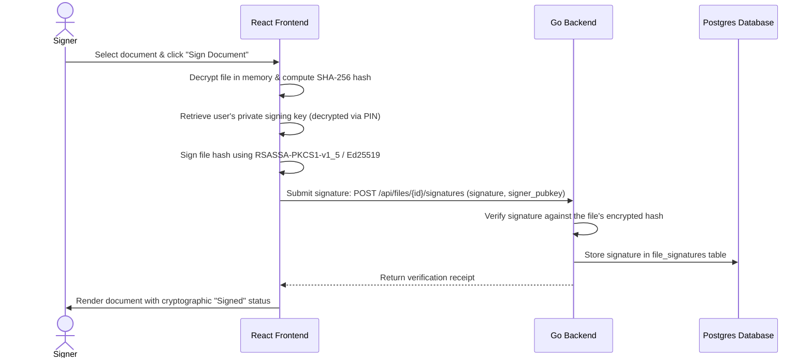

# Step 2: ZK-Signatures: Zero-Knowledge Cryptographic File Signatures

This step introduces a browser-side cryptographic document signing framework. Users can sign documents using their private keys, generating independent verification receipts that prove consent and authenticity without exposing the file's contents to the server.

---

## 🎯 Goal
Provide legal-grade cryptographic signatures for documents stored in the vault. The signature must be computed browser-side using the signer's private RSA/Ed25519 key, verifying the file hash (SHA-256) rather than the cleartext payload, maintaining the zero-knowledge privacy boundary.

---

## 🏗️ Architecture & Cryptographic Flow



### 1. Key Management
- During user signup, a dedicated Signing Key Pair (RSA-PSS or Ed25519) is generated browser-side.
- The private key is encrypted using the user's PIN/Password and saved in the user's profile metadata.
- When signing a document, the user inputs their PIN, decrypting the private signing key in-memory.

### 2. Hash-Only Verification
- The server does not have access to the file cleartext, but it has the encrypted file ciphertext.
- To prove that the signature matches the file without decrypting it, the signature is computed on the SHA-256 hash of the **ciphertext** (to prove delivery integrity) or on the **cleartext** (to prove content consent).
- To prove content consent securely, the cleartext SHA-256 hash is computed browser-side, signed, and the server validates the signature mathematically against the public key, recording the cryptographic proof in the database.

---

## 💻 Proposed Changes

### 1. Database Schema
#### [NEW] [049_create_file_signatures.sql](file:///lamp/www/QuantiX-Drive/sql/schema/049_create_file_signatures.sql)
```sql
CREATE TABLE file_signatures (
  id UUID PRIMARY KEY DEFAULT gen_random_uuid(),
  file_id UUID NOT NULL REFERENCES files(id) ON DELETE CASCADE,
  user_id UUID NOT NULL REFERENCES users(id) ON DELETE CASCADE,
  signature BYTEA NOT NULL,
  public_key TEXT NOT NULL,
  created_at TIMESTAMPTZ DEFAULT NOW()
);
CREATE INDEX idx_file_signatures_file_id ON file_signatures(file_id);
```

### 2. Go Backend Handler
#### [NEW] [handle_signatures.go](file:///lamp/www/QuantiX-Drive/handle_signatures.go)
- `handlerSignFile`: Accepts `signature` and `public_key` and inserts it into `file_signatures`.
- `handlerGetFileSignatures`: Retrieves all signatures for a specific file to display in the UI.

### 3. Frontend Components
#### [NEW] [SignaturePanel.tsx](file:///lamp/www/QuantiX-Drive/vaultdrive_client/src/components/signatures/SignaturePanel.tsx)
- Sidebar/slide-over displaying active signatures for the selected file.
- Action button to sign the file (triggering PIN prompt, decryption, hashing, and signature request).

---

## 🎨 Brand Customization

### QuantiX Neon
- Cyberpunk cryptographic dashboard overlay.
- Visual "Signature Seal" with neon green circular glow.
- Live verification log displaying hexadecimal signature bytes (`font-mono`).

### ABRN Burgundy
- Sophisticated corporate sign-off card.
- Animated burgundy "Wax Seal" indicating verified cryptographic signature.
- Traditional legal layout with timestamps and signer identity blocks.

---

## 🧪 Verification Plan

### Automated Tests
- **Go Tests**: Unit test for `handle_signatures.go` checking signature insert and query routes.
- **Frontend Tests**: Vitest verifying Web Crypto RSA/Ed25519 signing functions and hash outputs.
- **E2E Tests**: Playwright flow: Upload document, sign with PIN, verify signature block appears and remains valid.
