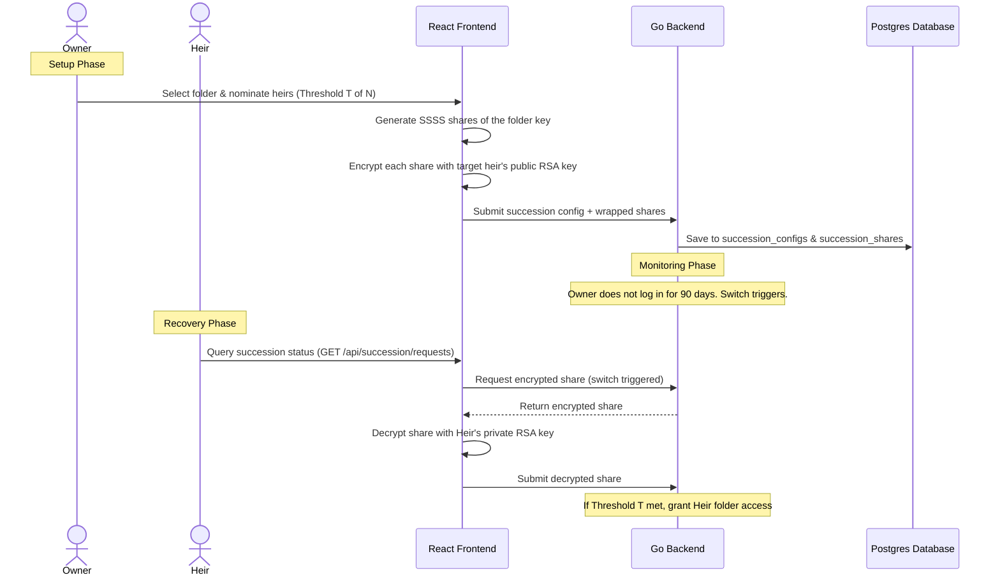

# Step 3: Cryptographic Dead Man's Switch & Account Succession

This step introduces a secure, zero-knowledge account succession protocol. If an owner is inactive for a pre-configured period, designated heirs can reconstruct access to specific vault folders through custodian cooperation, keeping the server blind to the data.

---

## 🎯 Goal
Implement a decentralized, time-locked succession switch. If the owner fails to interact with the system for $D$ days, the switch triggers, allowing designated heirs to download and decrypt SSSS vault-key shares, granting them folder access without exposing the owner's credentials to the server.

---

## 🏗️ Architecture & Cryptographic Flow



### 1. Zero-Knowledge Key Splitting
- The master key for the inherited folder is split using SSSS browser-side into $N$ shares with threshold $T$.
- Each share is encrypted with the public RSA key of the nominated heir, keeping the server blind.

### 2. Time-Locked Release
- The Go backend monitors the owner's `last_active_at` timestamp (updated on login/API requests).
- If `now() - last_active_at > inactivity_days`, the status shifts to `triggered`.
- Heir endpoints are strictly blocked with `403 Forbidden` unless the status is `triggered`.

---

## 💻 Proposed Changes

### 1. Database Schema
#### [NEW] [050_create_succession_tables.sql](file:///lamp/www/QuantiX-Drive/sql/schema/050_create_succession_tables.sql)
```sql
CREATE TABLE succession_configs (
  id UUID PRIMARY KEY DEFAULT gen_random_uuid(),
  owner_id UUID NOT NULL REFERENCES users(id) ON DELETE CASCADE,
  folder_id UUID NOT NULL REFERENCES folders(id) ON DELETE CASCADE,
  inactivity_days INT NOT NULL DEFAULT 90,
  threshold INT NOT NULL,
  created_at TIMESTAMPTZ DEFAULT NOW()
);

CREATE TABLE succession_shares (
  id UUID PRIMARY KEY DEFAULT gen_random_uuid(),
  config_id UUID NOT NULL REFERENCES succession_configs(id) ON DELETE CASCADE,
  heir_id UUID NOT NULL REFERENCES users(id) ON DELETE CASCADE,
  encrypted_share BYTEA NOT NULL,
  decrypted_share_part BYTEA,
  status VARCHAR(50) NOT NULL DEFAULT 'pending', -- 'pending', 'approved'
  created_at TIMESTAMPTZ DEFAULT NOW()
);
```

### 2. Go Backend Handlers
#### [NEW] [handle_succession.go](file:///lamp/www/QuantiX-Drive/handle_succession.go)
- `handlerCreateSuccession`: Creates config and saves encrypted shares.
- `handlerGetSuccessionStatus`: Checks if the owner's inactivity triggers release.
- `handlerSubmitSuccessionApproval`: Allows heirs to request their share, decrypt it, and submit the decrypted share part. Once threshold is met, mounts folder sharing for heirs.

### 3. Frontend Pages
#### [NEW] [SuccessionSetup.tsx](file:///lamp/www/QuantiX-Drive/vaultdrive_client/src/components/succession/SuccessionSetup.tsx)
- Configuration pane in Settings to select inheritance folder, nominate heirs, and set the days limit.

---

## 🎨 Brand Customization

### QuantiX Neon
- Cyberpunk grid HUD timer.
- Neon orange warning countdown badge.
- Interactive network node graphs displaying active custodian connections.

### ABRN Burgundy
- Sophisticated luxury hourglass widget showing time remaining until unlock.
- Classic corporate alerts warning the owner of upcoming inheritance releases.

---

## 🧪 Verification Plan

### Automated Tests
- **Go Tests**: Unit test for time-lock verification (manually updating `last_active_at` in DB to test trigger states).
- **E2E Tests**: Playwright scripts simulating inactivity trigger, heir logins, share approvals, and successful folder access grant.
