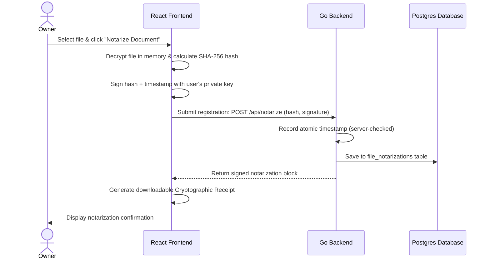

# Step 4: Zero-Knowledge Proof of File Custody & Notarization

This step implements a secure, zero-knowledge file notarization system. Users can cryptographically register proofs of custody for documents at a specific timestamp, generating verifiable receipts without revealing the document content or metadata to third parties.

---

## 🎯 Goal
Provide verifiable proof-of-existence and proof-of-custody. The system must compute the file hash browser-side, register it on the server with a timestamp, and generate a downloadable JSON/PDF verification receipt that can be validated offline.

---

## 🏗️ Architecture & Cryptographic Flow



### 1. Zero-Knowledge Proof construction
- Since the server holds only file ciphertext, notarization must verify the **cleartext** hash to be useful in legal contexts (e.g. proving you wrote a specific contract or piece of code).
- The hash of the cleartext is calculated in browser memory: `SHA-256(cleartext)`.
- The signature is calculated: `Sign(SHA-256(cleartext) || timestamp)`.
- The server records this hash and signature. This proves the user possessed the cleartext at the recorded timestamp.

### 2. Receipt Merkle Structure
- To enable offline verification, the user receives a receipt containing:
  - Signer username & public key.
  - Cleartext SHA-256 hash.
  - Signed timestamp block.
  - Verification instructions.

---

## 💻 Proposed Changes

### 1. Database Schema
#### [NEW] [051_create_file_notarizations.sql](file:///lamp/www/QuantiX-Drive/sql/schema/051_create_file_notarizations.sql)
```sql
CREATE TABLE file_notarizations (
  id UUID PRIMARY KEY DEFAULT gen_random_uuid(),
  user_id UUID NOT NULL REFERENCES users(id) ON DELETE CASCADE,
  file_hash VARCHAR(64) NOT NULL,
  signature BYTEA NOT NULL,
  public_key TEXT NOT NULL,
  notarized_at TIMESTAMPTZ DEFAULT NOW()
);
CREATE INDEX idx_file_notarizations_hash ON file_notarizations(file_hash);
```

### 2. Go Backend Handler
#### [NEW] [handle_notarization.go](file:///lamp/www/QuantiX-Drive/handle_notarization.go)
- `handlerRegisterNotarization`: Receives hash and signature, records server timestamp, and inserts the record.
- `handlerVerifyHash`: Public API endpoint allowing external third parties to submit a file or hash and check if it was notarized.

### 3. Frontend Views
#### [NEW] [NotaryDashboard.tsx](file:///lamp/www/QuantiX-Drive/vaultdrive_client/src/components/notary/NotaryDashboard.tsx)
- Dedicated vault panel displaying notarized files, timestamps, and receipt downloads.

---

## 🎨 Brand Customization

### QuantiX Neon
- Cyberpunk ledger node animation.
- Flashing green neon "CUSTODY RECORDED" HUD terminal block.
- Technical receipt debugger interface displaying block hashes.

### ABRN Burgundy
- Traditional notary certificate overlay.
- High-resolution burgundy wax stamp detailing registry numbers and legal text.
- Printable PDF certificate generation.

---

## 🧪 Verification Plan

### Automated Tests
- **Frontend Math Tests**: Verify that changing even 1 byte of the document invalidates the generated verification receipt.
- **Go Tests**: Verify public verification endpoints block SQL injection and return correct JSON metadata.
- **E2E Tests**: Playwright scripts: Notarize file, download receipt, drag-and-drop the file + receipt into verification portal, and verify success status.
