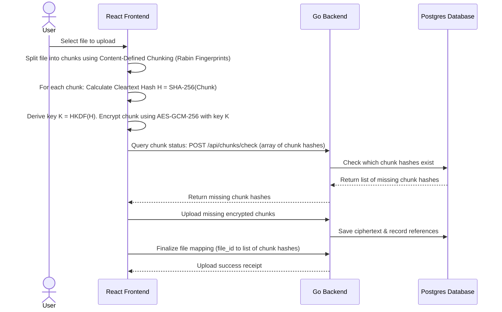

# Step 5: Client-Side Convergent Encryption & Blind Deduplication

This step implements client-side convergent encryption and Content-Defined Chunking (CDC) to enable secure database deduplication. This allows the server to skip storing redundant data without breaking the zero-knowledge privacy guarantee.

---

## 🎯 Goal
Introduce a storage-efficient zero-knowledge framework. Files must be chunked browser-side, encrypted using keys derived from chunk hashes, and deduplicated on the server. The server must remain blind to chunk cleartext but know which encrypted chunks are identical.

---

## 🏗️ Architecture & Cryptographic Flow



### 1. Convergent Encryption
- If two users upload the same file, a random key would produce different ciphertexts.
- Convergent encryption derives the key from the cleartext hash: `Key = HMAC-SHA256(file_hash, salt)`.
- Because the key is derived from the content, identical cleartext chunks produce identical ciphertexts, enabling server deduplication.
- Safe key-wrapping is maintained by encrypting the convergent keys with the user's master vault key.

### 2. Rabin Fingerprints & Chunking
- Instead of hashing whole files, files are split into chunks (average 1MB to 4MB) using Rabin Fingerprints sliding-window boundaries.
- If a user changes 1 byte of a 1GB file, only 1 chunk changes. The other 99% of chunks match existing hashes and are deduplicated.

---

## 💻 Proposed Changes

### 1. Database Schema
#### [NEW] [052_create_chunk_storage.sql](file:///lamp/www/QuantiX-Drive/sql/schema/052_create_chunk_storage.sql)
```sql
CREATE TABLE chunks (
  hash VARCHAR(64) PRIMARY KEY, -- SHA-256 of cleartext chunk
  storage_path TEXT NOT NULL,
  size INT NOT NULL,
  ref_count INT NOT NULL DEFAULT 1,
  created_at TIMESTAMPTZ DEFAULT NOW()
);

CREATE TABLE file_chunks (
  file_id UUID NOT NULL REFERENCES files(id) ON DELETE CASCADE,
  chunk_hash VARCHAR(64) NOT NULL REFERENCES chunks(hash),
  sequence_order INT NOT NULL,
  PRIMARY KEY (file_id, sequence_order)
);
```

### 2. Go Backend Handler
#### [NEW] [handle_chunks.go](file:///lamp/www/QuantiX-Drive/handle_chunks.go)
- `handlerCheckChunks`: Accepts list of hashes, queries the database, and returns missing ones.
- `handlerUploadChunk`: Saves chunk ciphertext and increments `ref_count`.
- `handlerDeleteFile`: Decrements chunk references, deleting files from physical storage only when `ref_count` hits 0.

### 3. Frontend Processing
- **`rabin-chunker.ts`**: Web Worker component executing Rabin Fingerprint chunking in a background thread to prevent UI freezing.

---

## 🎨 Brand Customization

### QuantiX Neon
- Cyberpunk active data matrix visualization.
- "Storage optimization HUD" showing active de-duplication logs.
- Animated green nodes representing reused chunks.

### ABRN Burgundy
- Clean storage allocation widget showing "My Account Storage Saved" via a clear progress bar.
- Quiet corporate savings statistics dashboard.

---

## 🧪 Verification Plan

### Automated Tests
- **Vitest**: Verify Rabin chunker boundaries and convergent AES-GCM encrypt/decrypt consistency.
- **Go Tests**: Verify transaction safety during concurrent chunk reference updates.
- **E2E Tests**: Playwright scripts: Upload identical files from two different user accounts, verify the second upload finishes instantly and the storage directory contains only one copy of the file.
