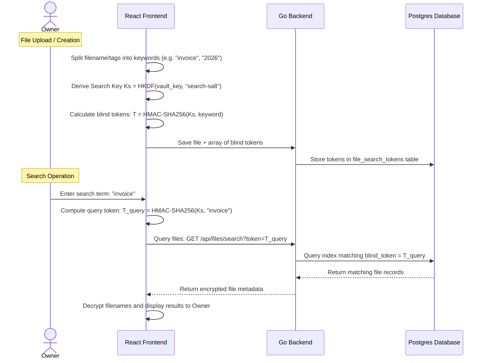

# Step 6: Searchable Symmetric Encryption (SSE) for Blind Vault Search

This step implements a Searchable Symmetric Encryption (SSE) scheme to allow searching through files, folders, and tags without leaking search queries or metadata contents to the server.

---

## 🎯 Goal
Build a private, cryptographically blind search mechanism. The browser must generate blind search tokens from filenames and tags, save them to the server, and query them using query tokens. The server must be able to index and return results without learning the search terms.

---

## 🏗️ Architecture & Cryptographic Flow



### 1. Blind Indexing
- The server stores filenames in encrypted form. To search them, the client generates a unique hash for each word.
- To prevent dictionary attacks on the hashes, the hashes are keyed using a private search key derived from the user's master key: `Token = HMAC-SHA256(SearchKey, word)`.
- The server stores these blind tokens alongside the file record.

### 2. Search Query Execution
- To search for a word, the browser derives the same HMAC token for the search term.
- It queries the database using the token. Since the token is a deterministic hash, the database can use standard indexes for fast lookups.
- The server has no knowledge of what keyword the token represents, preserving zero-knowledge security.

---

## 💻 Proposed Changes

### 1. Database Schema
#### [NEW] [053_create_file_search_tokens.sql](file:///lamp/www/QuantiX-Drive/sql/schema/053_create_file_search_tokens.sql)
```sql
CREATE TABLE file_search_tokens (
  file_id UUID NOT NULL REFERENCES files(id) ON DELETE CASCADE,
  blind_token VARCHAR(64) NOT NULL,
  PRIMARY KEY (file_id, blind_token)
);
CREATE INDEX idx_file_search_tokens_token ON file_search_tokens(blind_token);
```

### 2. Go Backend Handler
#### [NEW] [handle_search.go](file:///lamp/www/QuantiX-Drive/handle_search.go)
- `handlerSearchFiles`: Accepts a `token` query parameter, joins `file_search_tokens` with `files`, and returns the matches.

### 3. Frontend Search Integration
- **`search-indexing.ts`**: Helper class to tokenize filenames, filter stop words, and derive HMAC-SHA256 blind search tokens during file uploads.
- **`dashboard-layout.tsx` / `command-palette.tsx`**: Updated search inputs to derive tokens and call the secure search API.

---

## 🎨 Brand Customization

### QuantiX Neon
- Glowy search console HUD.
- Matrix-style binary drop trace matching animations.
- Cryptographic debug log visible under the input field.

### ABRN Burgundy
- High-end minimalist search box.
- Soft dropdown results with elegant fade-in animations.
- Refined category filters and search tag indicators.

---

## 🧪 Verification Plan

### Automated Tests
- **Vitest**: Verify tokenization splits special characters and hashes keywords correctly.
- **Go Tests**: Check database index usage during search query execution.
- **E2E Tests**: Playwright scripts: Upload "corporate-secrets.docx", search for "secrets", verify file appears, search for "secrets-fake", verify no results. Check backend logs to confirm the keyword "secrets" never appears in transit.
