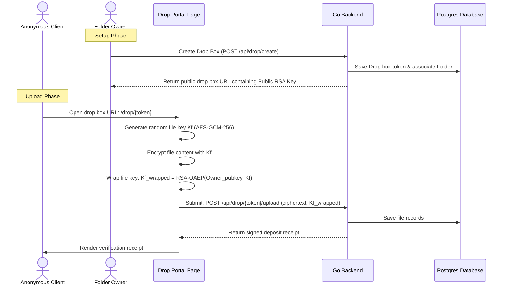

# Step 7: Zero-Knowledge Intake Tickets & Cryptographic File Drop Boxes

This step introduces ZK-Intake Tickets, transforming basic folder drops into cryptographically secure file intake portals. External, unauthenticated users can upload files that are encrypted browser-side using the owner's public key, ensuring only the owner can access them.

---

## 🎯 Goal
Implement public zero-knowledge upload dropboxes. The uploader's browser must encrypt the file using the owner's public key before transmission. Once uploaded, the uploader gets a verifiable deposit receipt, and only the folder owner can decrypt the file.

---

## 🏗️ Architecture & Cryptographic Flow



### 1. Public Key Intake Protocol
- The Drop Box link is formatted as: `https://.../drop/{token}#pubkey={Owner_RSA_Public_Key_Hex}`.
- Because the key is in the URL fragment (`#`), the server never sees the public key during initial page requests, preventing active key-injection attacks on the backend.
- The uploader's browser reads the hash fragment and encrypts the file key locally.

### 2. Verified Deposit Receipts
- When the upload completes, the server generates a signed receipt containing:
  - Document name & content hash.
  - Timestamp.
  - Cryptographic server signature.
- This receipt gives the external uploader absolute proof of successful, secure delivery.

---

## 💻 Proposed Changes

### 1. Database Schema
#### [MODIFY] [048_add_time_lock_auto_shred_to_public_share_links.sql](file:///lamp/www/QuantiX-Drive/sql/schema/048_add_time_lock_auto_shred_to_public_share_links.sql)
- Uses the existing upload route schemas, adding a `file_drop_receipts` table if auditability is requested.
#### [NEW] [054_create_file_drop_receipts.sql](file:///lamp/www/QuantiX-Drive/sql/schema/054_create_file_drop_receipts.sql)
```sql
CREATE TABLE file_drop_receipts (
  id UUID PRIMARY KEY DEFAULT gen_random_uuid(),
  upload_token_id UUID NOT NULL REFERENCES upload_tokens(id) ON DELETE CASCADE,
  file_hash VARCHAR(64) NOT NULL,
  receipt_signature BYTEA NOT NULL,
  uploaded_at TIMESTAMPTZ DEFAULT NOW()
);
```

### 2. Frontend Components
#### [NEW] [PublicDropPortal.tsx](file:///lamp/www/QuantiX-Drive/vaultdrive_client/src/pages/PublicDropPortal.tsx)
- The public-facing upload intake portal. Reads the URL fragment to extract the public key, performs AES encryption and RSA key wrapping, uploads the payload, and displays the deposit receipt.

---

## 🎨 Brand Customization

### QuantiX Neon
- Cyberpunk dark neon upload deck.
- Animated glsl drop zone with pulsing cyan scans.
- Glowy receipt summary display window.

### ABRN Burgundy
- Classic professional deposit box styling.
- Parchment-textured drag-and-drop frame.
- High-end corporate download verification ticket.

---

## 🧪 Verification Plan

### Automated Tests
- **Vitest**: Verify file key wrapping with RSA keys and decrypt validation matches.
- **Go Tests**: Check validation on invalid upload tokens.
- **E2E Tests**: Playwright scripts: Generate drop box link, load public drop page, drag and drop test file, upload, download receipt, verify owner can successfully log in and decrypt the file.
