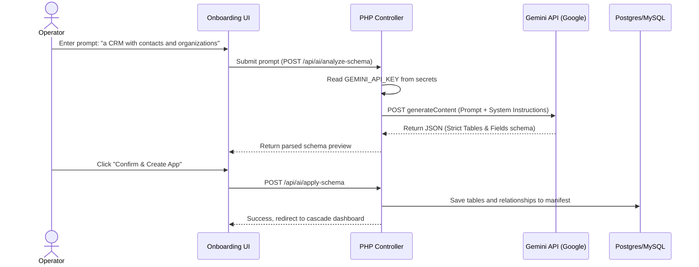

# Step 3: Gemini/LLM API Integration & Natural Language Ingestion

This step integrates the Gemini API into the `uappgenerator` backend, enabling dynamic, natural-language-to-schema ingestion. Users can type what app they want, and the AI automatically designs the tables and relationships.

---

## 🎯 Goal
Wire the AI ingestion endpoints (`POST /api/ai/analyze-schema` and `POST /api/ai/apply-schema`) to call Gemini's API, parsing user requests into structured manifest JSON schemas containing entities, columns, primary keys, and foreign-key links.

---

## 🏗️ AI Ingestion Pipeline



### 1. Ingestion Prompts & System Instructions
- Backend prompt constructs a clear role definition:
  - *"You are a database architect. Parse the user's description into a raw SQL-compliant table schema. Output strict GSON/JSON matching the uappgenerator manifest format."*
- Schema specification constraint:
  - Table names must be singular and lowercase.
  - Primary keys must follow the pattern `{table}_id`.
  - Output format must strictly follow:
    ```json
    {
      "tables": [
        {
          "name": "contact",
          "role": "entity",
          "fields": [
            { "name": "contact_id", "type": "INT", "key": "PRI" },
            { "name": "first_name", "type": "VARCHAR(255)" }
          ]
        }
      ],
      "relationships": []
    }
    ```

---

## 💻 Code Changes

### 1. Secrets Management
Add the Gemini credential to `/lamp/www/uappgenerator/.env`:
```ini
GEMINI_API_KEY="AIzaSyYourGeminiAPIKeyHere"
```
Read the key securely inside PHP using:
```php
$apiKey = Secrets::get('GEMINI_API_KEY');
```

### 2. PHP Route Handlers
#### [NEW] [AiController.php](file:///lamp/www/uappgenerator/src/Controllers/AiController.php)
- Implements `analyzeSchema($prompt)`:
  - Performs an HTTP POST using Guzzle to the Google API endpoint:
    `https://generativelanguage.googleapis.com/v1beta/models/gemini-2.5-pro:generateContent?key=`
  - Enforces strict response JSON parsing.
- Implements `applySchema($appId, $schemaJson)`:
  - Checks naming contracts.
  - Inserts the generated tables and relationships into the database.

---

## 🧪 Verification Plan
- Send a mock ingestion request via curl:
  ```bash
  curl -X POST -H "Content-Type: application/json" -d '{"prompt":"a clean task board"}' http://localhost:8099/api/ai/analyze-schema
  ```
- Verify that it returns valid structured JSON tables and relationships.
