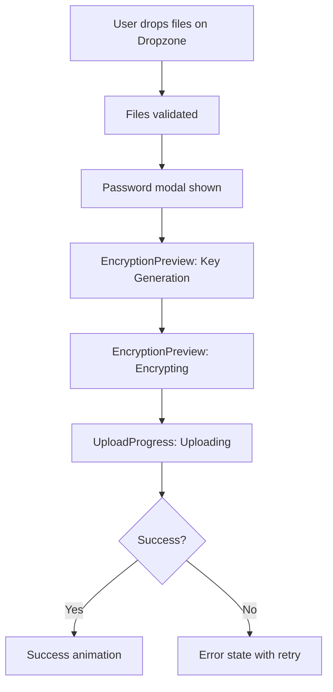

# Phase 2C: Upload Components - Implementation Plan

**VaultDrive v2.0 - Ascension Protocol**

---

## 📋 Overview

Phase 2C focuses on creating beautiful, animated upload components that showcase VaultDrive's zero-knowledge encryption. These components will transform the upload experience from a basic file input to an immersive, trust-building interaction.

### Goals
1. Create a drag-and-drop upload zone with visual feedback
2. Build an animated progress indicator showing encryption + upload stages
3. Design an encryption preview animation that builds user trust
4. Integrate seamlessly with existing crypto.ts utilities

---

## 🎯 Components to Create

### 1. Dropzone Component

**File:** `vaultdrive_client/src/components/upload/dropzone.tsx`

```typescript
interface DropzoneProps {
  onFilesDrop: (files: File[]) => void;
  onUploadStart?: () => void;
  maxFileSize?: number;           // Default: 100MB
  acceptedTypes?: string[];       // Default: all types
  multiple?: boolean;             // Default: true
  disabled?: boolean;
  className?: string;
}
```

**Features:**
- Full-width drag-and-drop zone with glassmorphism styling
- Visual states: idle, drag-over, uploading, success, error
- Animated border pulse on drag-over
- File type and size validation
- Multiple file support
- Click-to-browse fallback
- Keyboard accessible (Enter/Space to open file dialog)

**Visual States:**

```
┌─────────────────────────────────────────────────────────────┐
│                                                             │
│                    ┌─────────────────┐                      │
│                    │   📁 Upload     │                      │
│                    │     Icon        │                      │
│                    └─────────────────┘                      │
│                                                             │
│           Drop files here to encrypt & upload               │
│                                                             │
│              or click to browse your files                  │
│                                                             │
│         ─────────────────────────────────────               │
│         Supported: All file types • Max: 100MB              │
│                                                             │
└─────────────────────────────────────────────────────────────┘
```

**Drag-Over State:**
- Border changes to accent color with pulse animation
- Background becomes slightly more opaque
- Icon animates (scale up/down)
- Text changes to "Release to encrypt..."

---

### 2. Upload Progress Component

**File:** `vaultdrive_client/src/components/upload/upload-progress.tsx`

```typescript
interface UploadProgressProps {
  files: UploadingFile[];
  onCancel?: (fileId: string) => void;
  onRetry?: (fileId: string) => void;
  className?: string;
}

interface UploadingFile {
  id: string;
  name: string;
  size: number;
  status: 'pending' | 'encrypting' | 'uploading' | 'complete' | 'error';
  progress: number;           // 0-100
  encryptionProgress: number; // 0-100
  uploadProgress: number;     // 0-100
  error?: string;
}
```

**Features:**
- Multi-file upload queue display
- Two-stage progress: Encryption → Upload
- Animated progress bars with gradient
- File size and time remaining estimates
- Cancel/retry buttons per file
- Success checkmark animation
- Error state with retry option

**Visual Layout:**

```
┌─────────────────────────────────────────────────────────────┐
│  📄 document.pdf                              ✕ Cancel      │
│  ├── 🔐 Encrypting...  ████████████░░░░░░░░  75%           │
│  └── ☁️  Uploading...   ░░░░░░░░░░░░░░░░░░░░  0%            │
│                                                             │
│  📄 photo.jpg                                 ✓ Complete    │
│  ├── 🔐 Encrypted      ████████████████████  100%          │
│  └── ☁️  Uploaded       ████████████████████  100%          │
│                                                             │
│  📄 video.mp4                                 ↻ Retry       │
│  └── ❌ Error: File too large                               │
└─────────────────────────────────────────────────────────────┘
```

**Progress Animation:**
- Smooth gradient animation on progress bars
- Pulse effect during active encryption
- Checkmark morphs from circle on completion
- Shake animation on error

---

### 3. Encryption Preview Component

**File:** `vaultdrive_client/src/components/upload/encryption-preview.tsx`

```typescript
interface EncryptionPreviewProps {
  isActive: boolean;
  fileName?: string;
  fileSize?: number;
  stage: 'idle' | 'generating-key' | 'encrypting' | 'complete';
  className?: string;
}
```

**Features:**
- Visual representation of encryption process
- Three-stage animation:
  1. Key generation (key icon with particles)
  2. File encryption (file → lock animation)
  3. Secure upload (lock → cloud animation)
- Educational tooltips explaining each stage
- Trust-building messaging

**Animation Sequence:**

```
Stage 1: Key Generation
┌─────────────────────────────────────────┐
│                                         │
│           🔑 ✨ ✨ ✨                    │
│                                         │
│    "Generating your encryption key..."  │
│                                         │
│    Your key never leaves your device    │
│                                         │
└─────────────────────────────────────────┘

Stage 2: Encrypting
┌─────────────────────────────────────────┐
│                                         │
│        📄 ──────→ 🔒                    │
│                                         │
│    "Encrypting document.pdf..."         │
│                                         │
│    AES-256-GCM • Military-grade         │
│                                         │
└─────────────────────────────────────────┘

Stage 3: Uploading
┌─────────────────────────────────────────┐
│                                         │
│        🔒 ──────→ ☁️                     │
│                                         │
│    "Uploading encrypted data..."        │
│                                         │
│    Server sees only encrypted bytes     │
│                                         │
└─────────────────────────────────────────┘
```

---

## 📁 File Structure

```
vaultdrive_client/src/components/upload/
├── dropzone.tsx           # Main drag-and-drop component
├── upload-progress.tsx    # Progress indicator component
├── encryption-preview.tsx # Encryption animation component
└── index.ts               # Barrel export
```

---

## 🎨 CSS Animations

Add to `vaultdrive_client/src/styles/animations.css`:

```css
/* Dropzone Animations */
@keyframes dropzone-pulse {
  0%, 100% {
    border-color: var(--accent-primary);
    box-shadow: 0 0 0 0 rgba(99, 102, 241, 0.4);
  }
  50% {
    border-color: var(--accent-secondary);
    box-shadow: 0 0 0 10px rgba(99, 102, 241, 0);
  }
}

@keyframes upload-icon-bounce {
  0%, 100% { transform: translateY(0); }
  50% { transform: translateY(-10px); }
}

/* Progress Bar Animations */
@keyframes progress-gradient {
  0% { background-position: 0% 50%; }
  50% { background-position: 100% 50%; }
  100% { background-position: 0% 50%; }
}

@keyframes progress-pulse {
  0%, 100% { opacity: 1; }
  50% { opacity: 0.7; }
}

/* Encryption Preview Animations */
@keyframes key-sparkle {
  0%, 100% { opacity: 0; transform: scale(0); }
  50% { opacity: 1; transform: scale(1); }
}

@keyframes file-to-lock {
  0% { transform: translateX(0); opacity: 1; }
  50% { transform: translateX(50px); opacity: 0.5; }
  100% { transform: translateX(100px); opacity: 0; }
}

@keyframes lock-appear {
  0% { transform: scale(0) rotate(-180deg); opacity: 0; }
  100% { transform: scale(1) rotate(0deg); opacity: 1; }
}

/* Success Animation */
@keyframes checkmark-draw {
  0% { stroke-dashoffset: 100; }
  100% { stroke-dashoffset: 0; }
}

@keyframes success-circle {
  0% { transform: scale(0); opacity: 0; }
  50% { transform: scale(1.2); opacity: 1; }
  100% { transform: scale(1); opacity: 1; }
}
```

---

## 🔧 Integration with Existing Code

### Current Upload Flow (files.tsx)

The existing upload flow in [`files.tsx`](../vaultdrive_client/src/pages/files.tsx) works as follows:

1. User selects file via `<input type="file">`
2. User enters encryption password in modal
3. `performUpload()` is called:
   - Generate salt
   - Derive key from password using PBKDF2
   - Encrypt file using AES-256-GCM
   - Upload encrypted blob with metadata

### New Upload Flow



### Integration Points

1. **Dropzone → files.tsx**
   - Replace `<input type="file">` with `<Dropzone>`
   - Pass `onFilesDrop` callback to handle file selection
   - Trigger password modal on file drop

2. **UploadProgress → files.tsx**
   - Track upload state in component state
   - Update progress during encryption and upload
   - Show in modal or inline

3. **EncryptionPreview → files.tsx**
   - Show during encryption phase
   - Update stage based on current operation

---

## 📝 Implementation Steps

### Step 1: Create Dropzone Component

```typescript
// dropzone.tsx
import { useState, useRef, useCallback } from 'react';
import { Upload, FileUp, AlertCircle } from 'lucide-react';
import { cn } from '../../lib/utils';

export function Dropzone({ 
  onFilesDrop, 
  maxFileSize = 100 * 1024 * 1024, // 100MB
  acceptedTypes,
  multiple = true,
  disabled = false,
  className 
}: DropzoneProps) {
  const [isDragging, setIsDragging] = useState(false);
  const [error, setError] = useState<string | null>(null);
  const inputRef = useRef<HTMLInputElement>(null);

  const handleDragOver = useCallback((e: React.DragEvent) => {
    e.preventDefault();
    if (!disabled) setIsDragging(true);
  }, [disabled]);

  const handleDragLeave = useCallback((e: React.DragEvent) => {
    e.preventDefault();
    setIsDragging(false);
  }, []);

  const validateFiles = (files: File[]): File[] => {
    return files.filter(file => {
      if (file.size > maxFileSize) {
        setError(`File "${file.name}" exceeds ${formatSize(maxFileSize)} limit`);
        return false;
      }
      if (acceptedTypes && !acceptedTypes.includes(file.type)) {
        setError(`File type "${file.type}" not accepted`);
        return false;
      }
      return true;
    });
  };

  const handleDrop = useCallback((e: React.DragEvent) => {
    e.preventDefault();
    setIsDragging(false);
    setError(null);
    
    if (disabled) return;
    
    const files = Array.from(e.dataTransfer.files);
    const validFiles = validateFiles(multiple ? files : [files[0]]);
    
    if (validFiles.length > 0) {
      onFilesDrop(validFiles);
    }
  }, [disabled, multiple, onFilesDrop, validateFiles]);

  const handleClick = () => {
    if (!disabled) inputRef.current?.click();
  };

  const handleInputChange = (e: React.ChangeEvent<HTMLInputElement>) => {
    const files = Array.from(e.target.files || []);
    const validFiles = validateFiles(files);
    if (validFiles.length > 0) {
      onFilesDrop(validFiles);
    }
    e.target.value = ''; // Reset input
  };

  return (
    <div
      onDragOver={handleDragOver}
      onDragLeave={handleDragLeave}
      onDrop={handleDrop}
      onClick={handleClick}
      onKeyDown={(e) => e.key === 'Enter' && handleClick()}
      tabIndex={0}
      role="button"
      aria-label="Upload files"
      className={cn(
        'glass rounded-xl p-8 text-center cursor-pointer transition-all duration-300',
        'border-2 border-dashed border-white/20',
        'hover:border-white/40 hover:bg-white/5',
        'focus:outline-none focus:ring-2 focus:ring-primary/50',
        isDragging && 'border-primary bg-primary/10 animate-dropzone-pulse',
        disabled && 'opacity-50 cursor-not-allowed',
        className
      )}
    >
      <input
        ref={inputRef}
        type="file"
        multiple={multiple}
        accept={acceptedTypes?.join(',')}
        onChange={handleInputChange}
        className="hidden"
      />
      
      <div className={cn(
        'transition-transform duration-300',
        isDragging && 'animate-upload-icon-bounce'
      )}>
        {isDragging ? (
          <FileUp className="w-12 h-12 mx-auto mb-4 text-primary" />
        ) : (
          <Upload className="w-12 h-12 mx-auto mb-4 text-muted-foreground" />
        )}
      </div>
      
      <p className="text-lg font-medium mb-2">
        {isDragging ? 'Release to encrypt...' : 'Drop files here to encrypt & upload'}
      </p>
      
      <p className="text-sm text-muted-foreground mb-4">
        or click to browse your files
      </p>
      
      {error && (
        <div className="flex items-center justify-center gap-2 text-destructive text-sm">
          <AlertCircle className="w-4 h-4" />
          {error}
        </div>
      )}
      
      <div className="text-xs text-muted-foreground/60 mt-4">
        Supported: All file types • Max: {formatSize(maxFileSize)}
      </div>
    </div>
  );
}
```

### Step 2: Create Upload Progress Component

```typescript
// upload-progress.tsx
import { useState } from 'react';
import { File, Lock, Cloud, Check, X, RefreshCw, AlertCircle } from 'lucide-react';
import { cn } from '../../lib/utils';
import { GlassCard } from '../glass/glass-card';

export function UploadProgress({ files, onCancel, onRetry, className }: UploadProgressProps) {
  return (
    <GlassCard className={cn('p-4 space-y-4', className)}>
      {files.map((file) => (
        <UploadFileItem
          key={file.id}
          file={file}
          onCancel={() => onCancel?.(file.id)}
          onRetry={() => onRetry?.(file.id)}
        />
      ))}
    </GlassCard>
  );
}

function UploadFileItem({ file, onCancel, onRetry }: {
  file: UploadingFile;
  onCancel?: () => void;
  onRetry?: () => void;
}) {
  const isComplete = file.status === 'complete';
  const isError = file.status === 'error';
  const isActive = file.status === 'encrypting' || file.status === 'uploading';

  return (
    <div className="space-y-2">
      <div className="flex items-center justify-between">
        <div className="flex items-center gap-2">
          <File className="w-4 h-4 text-muted-foreground" />
          <span className="font-medium truncate max-w-[200px]">{file.name}</span>
          <span className="text-xs text-muted-foreground">
            {formatSize(file.size)}
          </span>
        </div>
        
        <div className="flex items-center gap-2">
          {isComplete && (
            <div className="flex items-center gap-1 text-green-500">
              <Check className="w-4 h-4" />
              <span className="text-xs">Complete</span>
            </div>
          )}
          {isError && (
            <button
              onClick={onRetry}
              className="flex items-center gap-1 text-destructive hover:text-destructive/80"
            >
              <RefreshCw className="w-4 h-4" />
              <span className="text-xs">Retry</span>
            </button>
          )}
          {isActive && (
            <button
              onClick={onCancel}
              className="text-muted-foreground hover:text-foreground"
            >
              <X className="w-4 h-4" />
            </button>
          )}
        </div>
      </div>
      
      {/* Encryption Progress */}
      <div className="flex items-center gap-2">
        <Lock className={cn(
          'w-3 h-3',
          file.encryptionProgress === 100 ? 'text-green-500' : 'text-muted-foreground'
        )} />
        <div className="flex-1 h-1.5 bg-white/10 rounded-full overflow-hidden">
          <div
            className={cn(
              'h-full rounded-full transition-all duration-300',
              file.status === 'encrypting' && 'animate-progress-pulse',
              file.encryptionProgress === 100 ? 'bg-green-500' : 'bg-gradient-to-r from-primary to-secondary'
            )}
            style={{ width: `${file.encryptionProgress}%` }}
          />
        </div>
        <span className="text-xs text-muted-foreground w-8">
          {file.encryptionProgress}%
        </span>
      </div>
      
      {/* Upload Progress */}
      <div className="flex items-center gap-2">
        <Cloud className={cn(
          'w-3 h-3',
          file.uploadProgress === 100 ? 'text-green-500' : 'text-muted-foreground'
        )} />
        <div className="flex-1 h-1.5 bg-white/10 rounded-full overflow-hidden">
          <div
            className={cn(
              'h-full rounded-full transition-all duration-300',
              file.status === 'uploading' && 'animate-progress-pulse',
              file.uploadProgress === 100 ? 'bg-green-500' : 'bg-gradient-to-r from-primary to-secondary'
            )}
            style={{ width: `${file.uploadProgress}%` }}
          />
        </div>
        <span className="text-xs text-muted-foreground w-8">
          {file.uploadProgress}%
        </span>
      </div>
      
      {/* Error Message */}
      {isError && file.error && (
        <div className="flex items-center gap-2 text-destructive text-xs">
          <AlertCircle className="w-3 h-3" />
          {file.error}
        </div>
      )}
    </div>
  );
}
```

### Step 3: Create Encryption Preview Component

```typescript
// encryption-preview.tsx
import { useEffect, useState } from 'react';
import { Key, File, Lock, Cloud, Shield } from 'lucide-react';
import { cn } from '../../lib/utils';

export function EncryptionPreview({ 
  isActive, 
  fileName, 
  fileSize, 
  stage,
  className 
}: EncryptionPreviewProps) {
  if (!isActive) return null;

  return (
    <div className={cn(
      'glass rounded-xl p-6 text-center animate-fade-in',
      className
    )}>
      <div className="relative h-24 flex items-center justify-center mb-4">
        {stage === 'generating-key' && <KeyGenerationAnimation />}
        {stage === 'encrypting' && <EncryptingAnimation fileName={fileName} />}
        {stage === 'complete' && <CompleteAnimation />}
      </div>
      
      <p className="text-lg font-medium mb-2">
        {stage === 'generating-key' && 'Generating encryption key...'}
        {stage === 'encrypting' && `Encrypting ${fileName}...`}
        {stage === 'complete' && 'Encryption complete!'}
      </p>
      
      <p className="text-sm text-muted-foreground">
        {stage === 'generating-key' && 'Your key never leaves your device'}
        {stage === 'encrypting' && 'AES-256-GCM • Military-grade encryption'}
        {stage === 'complete' && 'Ready for secure upload'}
      </p>
      
      {fileSize && (
        <p className="text-xs text-muted-foreground/60 mt-2">
          {formatSize(fileSize)}
        </p>
      )}
    </div>
  );
}

function KeyGenerationAnimation() {
  return (
    <div className="relative">
      <Key className="w-12 h-12 text-primary animate-pulse" />
      <div className="absolute inset-0 flex items-center justify-center">
        {[...Array(6)].map((_, i) => (
          <span
            key={i}
            className="absolute text-yellow-400 animate-key-sparkle"
            style={{
              animationDelay: `${i * 0.2}s`,
              transform: `rotate(${i * 60}deg) translateY(-20px)`
            }}
          >
            ✨
          </span>
        ))}
      </div>
    </div>
  );
}

function EncryptingAnimation({ fileName }: { fileName?: string }) {
  return (
    <div className="flex items-center justify-center gap-4">
      <File className="w-8 h-8 text-muted-foreground animate-file-to-lock" />
      <div className="w-8 h-0.5 bg-gradient-to-r from-primary to-transparent" />
      <Lock className="w-10 h-10 text-primary animate-lock-appear" />
    </div>
  );
}

function CompleteAnimation() {
  return (
    <div className="relative">
      <div className="w-16 h-16 rounded-full bg-green-500/20 flex items-center justify-center animate-success-circle">
        <Shield className="w-8 h-8 text-green-500" />
      </div>
    </div>
  );
}
```

### Step 4: Create Barrel Export

```typescript
// index.ts
export { Dropzone } from './dropzone';
export { UploadProgress } from './upload-progress';
export { EncryptionPreview } from './encryption-preview';
export type { DropzoneProps, UploadProgressProps, UploadingFile, EncryptionPreviewProps } from './types';
```

### Step 5: Update files.tsx Integration

The existing [`files.tsx`](../vaultdrive_client/src/pages/files.tsx) needs to be updated to use the new components:

1. Import new components
2. Replace file input with Dropzone
3. Add UploadProgress to show during upload
4. Add EncryptionPreview to password modal
5. Track upload state for progress updates

---

## 🧪 Testing Checklist

- [ ] Dropzone accepts drag-and-drop files
- [ ] Dropzone validates file size limits
- [ ] Dropzone shows visual feedback on drag-over
- [ ] Click-to-browse works correctly
- [ ] Multiple file selection works
- [ ] Upload progress shows encryption stage
- [ ] Upload progress shows upload stage
- [ ] Cancel button stops upload
- [ ] Retry button works for failed uploads
- [ ] Encryption preview animations play correctly
- [ ] Integration with existing crypto.ts works
- [ ] Password modal flow unchanged
- [ ] Files appear in list after upload

---

## 📊 Success Metrics

1. **User Experience**
   - Upload flow feels smooth and responsive
   - Encryption process is visible and trust-building
   - Error states are clear and actionable

2. **Technical**
   - No regression in existing upload functionality
   - Animations perform at 60fps
   - Components are accessible (keyboard, screen reader)

3. **Design**
   - Consistent with glassmorphism design system
   - Animations match Phase 2A/2B aesthetic
   - Responsive on mobile devices

---

## 🚀 Next Steps After Phase 2C

### Phase 2D: Files Page Redesign
- Integrate Dropzone into files page
- Add grid/list view toggle
- Implement file cards with glassmorphism
- Add folder navigation

### Phase 3: New Capabilities
- Folder management (Phase 3A)
- Secure Notes / VaultPad (Phase 3B)
- File versioning (Phase 3C)
- File requests (Phase 3D)

---

## ✨ Summary

Phase 2C creates three essential upload components:

| Component | Purpose | Priority |
|-----------|---------|----------|
| `dropzone.tsx` | Drag-and-drop file selection | P0 |
| `upload-progress.tsx` | Multi-stage progress indicator | P0 |
| `encryption-preview.tsx` | Trust-building encryption animation | P1 |

These components will transform the upload experience from a basic file input to an immersive, trust-building interaction that showcases VaultDrive's zero-knowledge encryption.

**Ready for implementation in Code mode.**
